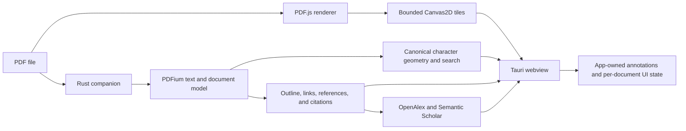

# Key

Key is a research-focused PDF reader. Its desktop application combines a Tauri
2 shell and TypeScript/React workspace with PDF.js rendering and the
repository's Rust/PDFium backend.

The active product lives in [`apps/key`](apps/key/). An earlier native GPUI
implementation remains under
[`experiments/gpui-pdf-reader`](experiments/gpui-pdf-reader/) as a working but
abandoned experiment. It proved the native architecture and still exercises
the shared Rust crates, but it is no longer a product target.

> Key is under active development. macOS on Apple silicon is the only
> platform currently built and tested. Local release bundles are ad-hoc signed,
> but there is no notarized public release yet.

## What works

- Multi-document tabs, split views, a floating Safari-style tab strip, and a
  view-owned control bar that adapts to the available width.
- Continuous scrolling and responsive pointer-anchored trackpad zoom with
  temporary client-side scaling while exact tiles are debounced.
- Bounded 512-physical-pixel PDF.js Canvas2D tiles instead of oversized
  full-page bitmaps.
- A selectable text layer anchored to the PDFium character sequence, including
  cross-line selection and harmonized selection/search/annotation geometry.
- Indexed document search with highlighted results, previous/next navigation,
  and per-document search state.
- Highlights in orange, green, blue, pink, or purple. A highlight with a
  comment also receives a matching underline.
- Markdown-backed comments with a reusable rich-text editor. Formatting is
  displayed directly in the editor and comment overview rather than exposing
  Markdown syntax.
- Document outlines, internal links, external links, and panels that float over
  the document while extending its horizontal scroll reach.
- Scientific citation overlays with grouped references, OpenAlex and Semantic
  Scholar enrichment, abstract/TLDR summaries, source links, and an expanded
  details modal.
- Anchored citation cards that remain interactive until the user clicks
  elsewhere in the view, including visible lookup progress and failure states.
- Native macOS menu actions for opening PDFs, zoom, actual size, fit width,
  search, outline, references, comments, sidebar, and split-view controls.
- A shared, data-driven design system. Chrome layout, materials, opacity,
  spacing, typography, shapes, and component behavior are resolved from typed
  configuration rather than duplicated as view-specific constants.

Forms are rendered for visual fidelity but are not interactive yet.

## Architecture



PDF.js owns visible rasterization. PDFium is not used as a second visual
renderer in the current application; it supplies the canonical character
sequence, normalized page geometry, indexed search, document structure, and
scientific analysis.

Opening is staged. PDF.js parsing and the native companion start in parallel.
The initial document and text geometry make the reader usable first; reference
analysis and scholarly lookups continue in the background and update the
already-open view as results arrive. The companion can hibernate its live
PDFium document after disposable text has been installed, keeping the storage
boundary flexible for a later SQLite-backed implementation.

Annotations store PDFium character ranges. Search and scientific-analysis
records carry normalized page bounds derived from the same native character
geometry. PDF.js converts those bounds into its current viewport only when it
paints an overlay. This keeps annotations, search results, citations, and text
selection stable across zoom levels without treating PDF.js text-item indices
as persistent document identity.

## Platform status

| Platform | Status |
|---|---|
| macOS, Apple silicon | Current development and release target |
| macOS, Intel | Not validated; the checked-in PDFium library is arm64 |
| Linux | Intended, not currently supported |
| Windows | Intended, not currently supported |

## Build and run the current app

Requirements:

- macOS with Xcode Command Line Tools
- A current stable Rust toolchain
- Node.js and npm

The repository includes the audited Apple-silicon PDFium library used during
development. It can be refreshed with the pinned fetch script.

```sh
./scripts/fetch-pdfium.sh
cd apps/key
npm install
npm run tauri -- dev
```

An alternative matching-architecture PDFium library can be supplied with
`PDFIUM_DYNAMIC_LIB_PATH`.

```sh
PDFIUM_DYNAMIC_LIB_PATH=/path/to/libpdfium.dylib \
  npm run tauri -- dev
```

To build the optimized macOS application and disk image:

```sh
cd apps/key
npm run tauri -- build
```

Tauri writes the local artifacts to:

- `apps/key/src-tauri/target/release/bundle/macos/Key.app`
- `apps/key/src-tauri/target/release/bundle/dmg/Key_0.1.0_aarch64.dmg`

These local artifacts are ad-hoc signed according to the current Tauri
configuration and are not notarized.

### Web-only development

The frontend can be opened without Tauri:

```sh
cd apps/key
npm run dev
```

Then use
`http://localhost:1420/?renderer=pdfjs-workspace`.

This is useful for layout and browser interaction work. Native PDFium search,
preprocessing, persistent companion state, and scholarly lookup require the
Tauri application; the browser path uses its PDF.js fallbacks.

## Controls

| Action | Input |
|---|---|
| Open PDF | Empty state, global `+`, File menu, or `Command-O` |
| Switch document | Floating tab strip |
| Split view | Global split control or View menu |
| Scroll | Trackpad, mouse wheel, or both trackpad axes |
| Zoom | Trackpad pinch, `Command`/`Control`-wheel, `−`/`+`, or `Command--` / `Command-=` |
| Actual size | Zoom value, View menu, or `Command-0` |
| Fit width | Control bar or View menu |
| Select text | Left-button drag |
| Copy selection | Floating selection control or `Command-C` |
| Highlight selection | One of the five floating color controls |
| Add or edit a comment | Floating note control |
| Search | Control bar, View menu, or `Command-F` |
| Next/previous result | Search controls or `Command-G` / `Command-Shift-G` |
| Outline, references, comments | Control bar or View menu |
| Dismiss a citation card | Click elsewhere in the PDF view |

Control-bar mode is retained when switching documents. Search queries and
comment state belong to each document, so returning to a tab restores its
previous state without leaking the query to another PDF.

## Design system

The base renderer-independent configuration is
[`assets/ui/key-glass.json`](assets/ui/key-glass.json). The current Tauri
profile merges it with
[`assets/ui/variations/safari-glass.json`](assets/ui/variations/safari-glass.json).

The same schema drives the GPUI and Tauri implementations. Views receive
resolved values through their host abstraction; they do not independently
hardcode tab placement, control order, widths, corner radii, translucency, or
motion policy. This is what allows the tab bar, split-tab segments, control
bar, and floating surfaces to change together.

Other checked-in visual configurations include:

- [`assets/ui/variations/clear-glass.json`](assets/ui/variations/clear-glass.json)
- [`assets/ui/variations/square-opaque.json`](assets/ui/variations/square-opaque.json)
- [`assets/ui/variations/safari-chrome.json`](assets/ui/variations/safari-chrome.json)

## Testing

For the current Tauri/PDF.js application:

```sh
cd apps/key
npm test
npm run build
npm run test:pdfjs-workspace-ux
cargo check --manifest-path src-tauri/Cargo.toml
```

The workspace UX smoke test opens a real browser, loads the deterministic
interaction fixture, and verifies annotation colors, comment underlines,
recoloring, rich Markdown editing, comment cards, and plain-highlight styling.

Native PDF.js performance scenarios are available separately:

```sh
npm run benchmark:pdfjs-tauri -- /absolute/path/to/document.pdf
npm run benchmark:pdfjs-workspace-tauri -- /absolute/path/to/pdf-directory
npm run benchmark:resources -- <tauri-pid>
```

The shared Rust suite, including the frozen GPUI experiment, remains available:

```sh
sh scripts/test.sh
```

Its macOS E2E cases live in [`tests/e2e`](tests/e2e/), and the shared
integration fixture is
[`tests/fixtures/interaction.pdf`](tests/fixtures/interaction.pdf).

## Project layout

| Path | Purpose |
|---|---|
| `apps/key/src/pdfjs` | Current PDF.js reader, overlays, workspace, and UI state |
| `apps/key/src-tauri` | Tauri shell, native PDFium companion, staged preprocessing, and lookup commands |
| `crates/key-pdf-core` | Renderer-independent PDF, text, search, and scientific-analysis domain logic |
| `crates/key-pdf-runtime` | Scheduling, cancellation, document sessions, and demand management |
| `crates/key-pdfium` | Native PDFium adapter |
| `extensions/key-reference` | Scholarly metadata, provider scheduling, throttling, and merging |
| `assets/ui` | Shared typed design-system configurations |
| `experiments/gpui-pdf-reader` | Frozen, working native GPUI experiment |
| `tests/fixtures` | Deterministic PDF fixtures used by both implementations |

The pinned AFFiNE submodule under
`apps/key/upstream-affine` is retained as a source reference.
The current desktop application does not boot AFFiNE or depend on its Electron
runtime.

## Why Tauri replaced the GPUI application

The GPUI reader reached a genuinely working state: it has a native PDFium tile
renderer, extension host, sidecar annotations, themes, and macOS integration.
It was valuable validation, not a failed prototype.

It is nevertheless frozen as an experiment. Key now targets Tauri because its
TypeScript ecosystem offers substantially richer building blocks for planned
feature components, Tauri has a more mature application and packaging surface,
and its webview model provides a clearer route to additional desktop platforms.
Maintaining two product frontends would dilute that advantage and force new UX
work to be implemented twice.

The experiment stays buildable so behavior can be compared and reusable Rust
work can be recovered. Run it explicitly:

```sh
./scripts/fetch-pdfium.sh
cargo run --locked -p gpui-pdf-reader -- /path/to/document.pdf
```

For an optimized GPUI build:

```sh
cargo build --release --locked -p gpui-pdf-reader
./target/release/gpui-pdf-reader /path/to/document.pdf
```

No new product features should be added directly to the GPUI application.
Useful renderer-neutral behavior belongs in the shared `key-*` crates; active
interface work belongs in `apps/key`.

Detailed background material remains in:

- [`notes/architecture.md`](notes/architecture.md)
- [`notes/text-layer.md`](notes/text-layer.md)
- [`notes/scheduling-and-zoom.md`](notes/scheduling-and-zoom.md)
- [`notes/links-and-scientific-references.md`](notes/links-and-scientific-references.md)
- [`extensions/README.md`](extensions/README.md)

## Current limitations

- Only macOS on Apple silicon is actively tested.
- Encrypted PDFs do not have a password prompt.
- Interactive forms, thumbnail navigation, and PDF-embedded annotation editing
  are not implemented.
- Tauri highlights and comments currently use versioned browser local storage.
  They are not written into the PDF and do not yet use the GPUI sidecar store
  or a database.
- Scholarly metadata depends on external providers and can be delayed by their
  availability and rate limits. Provider throttling and retry scheduling reduce
  failures but cannot eliminate them.
- The current release configuration is ad-hoc signed and not notarized.
- The AFFiNE/embedPDF/PDFium-WASM comparison path remains in the source tree for
  historical measurements, but it is not the active application renderer.

## License

Key source is MIT licensed. The supported dependency graph is restricted by
project policy to MIT, Apache-2.0, and more-permissive licenses.

See [`LICENSE`](LICENSE), [`THIRD_PARTY_NOTICES.md`](THIRD_PARTY_NOTICES.md),
and the PDFium notices in
[`vendor/pdfium/licenses`](vendor/pdfium/licenses/).
