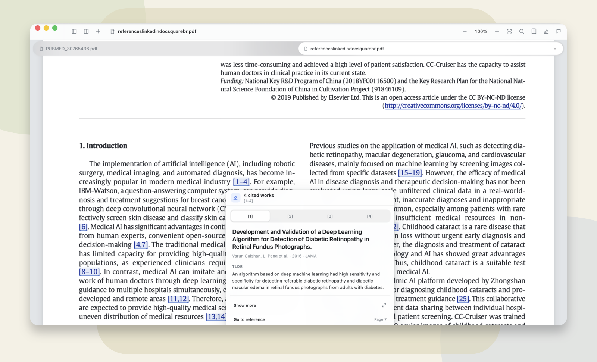
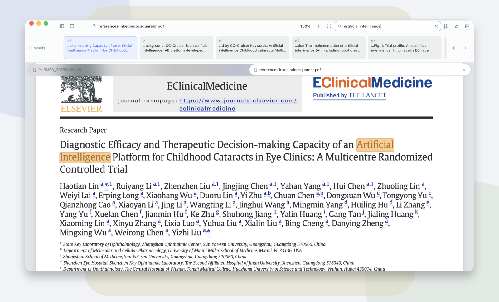
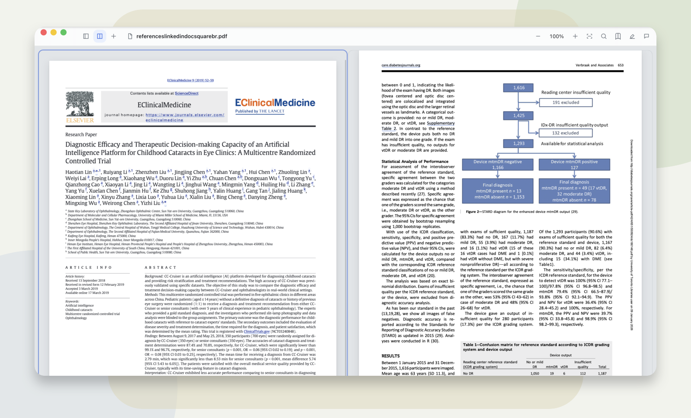
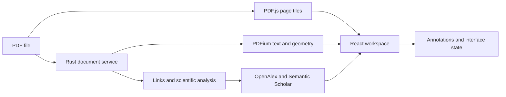

<p align="center">
  
</p>

<p align="center">
  <strong>A desktop workspace for reading, annotating, searching, and connecting scientific literature.</strong>
</p>

<p align="center">
  Key combines a PDF.js reading surface with native Rust and PDFium document services, structured annotations, and scholarly metadata.
</p>

<p align="center">
  <a href="#overview">Overview</a> ·
  <a href="#current-capabilities">Capabilities</a> ·
  <a href="#architecture">Architecture</a> ·
  <a href="#quick-start">Quick start</a> ·
  <a href="#documentation">Documentation</a>
</p>

<p align="center">
  
  
  
  <a href="LICENSE"></a>
</p>

<p align="center">
  
</p>

<p align="center">
  <sub>Bibliographic context for a grouped in-text citation, shown in the native Tauri application.</sub>
</p>

## Overview

Key is a desktop application for working with scientific PDFs. The current application provides continuous document reading, multiple open papers, split views, search, text selection, annotations, comments, outlines, links, and contextual information for academic references.

The document view is backed by two complementary representations:

- PDF.js parses and rasterizes the pages displayed in the workspace.
- A native Rust service uses PDFium for canonical character order, text geometry, hit testing, search, outlines, links, and preprocessing.

This separation allows the interface to use the TypeScript and React ecosystem while retaining a stable native document model for features that must survive changes in zoom, tile resolution, or renderer layout.

The planned scope extends beyond the reader into a connected research workspace. Library management, durable notes, relationships between papers and claims, writing surfaces, and source-grounded assistance are intended to use the same document identities and provenance model. These areas are not presented as implemented features.

| Area | Available now | Planned scope |
|----|----|----|
| Reading | Tabs, split views, continuous pages, outlines, links, search, responsive zoom | Library-level navigation and cross-document reading sessions |
| Annotation | Color highlights, comments, rich-text editing, stable text anchors | Durable sidecars, database-backed storage, and relationships between notes |
| References | In-text citation detection, grouped citations, metadata cards, source links | Citation graph navigation and integration with the broader knowledge layer |
| Research workspace | Per-document interface state and multi-paper viewing | Connected notes, claims, writing, and source-grounded assistance |

> Key is under active development. The current macOS build is intended for contributors and testing and is not yet a notarized public release.

## Interface

<table>
<tr>
<td width="50%">

</td>
<td width="50%">

</td>
</tr>
<tr>
<td valign="top">
<strong>Document search</strong><br/>
Results remain visible in an expanded control bar and are connected to normalized highlight regions on the page.
</td>
<td valign="top">
<strong>Split reading</strong><br/>
Two independently rendered documents can share the workspace while retaining separate position, zoom, and document state.
</td>
</tr>
</table>

The images above were captured from the Tauri application. The surrounding backgrounds and shadows are documentation framing; the complete application chrome is preserved inside each frame.

## Current capabilities

### Reading and navigation

- Multiple documents can remain open as tabs. Tabs resize to use the available strip width and move into an overflow state before titles become unreadable.
- A tab can contain a resizable two-document split. Each pane retains independent view state, while the workspace limits the number of fully resident readers.
- Pages use bounded high-resolution PDF.js tiles rather than one full-page canvas at the current zoom. Visible work is prioritized and stale rendering can be cancelled.
- Trackpad zoom immediately scales the current visual result and schedules sharper tiles after the interaction settles.
- Document outlines, internal destinations, external links, native menu actions, and document-level panels are integrated with the workspace.

### Text, search, and annotations

- Text selection and hit testing use PDFium character identities and geometry supplied by the native companion.
- Search results are computed against the native document text and displayed in a persistent results strip with page context.
- Selection, search, and annotation regions are normalized into visually consistent rectangles so whitespace and item boundaries do not create avoidable gaps.
- Highlights use the selected annotation color. Commented annotations also receive an underline; uncommented annotations use color alone.
- Comments use a reusable rich-text editor with Markdown-backed storage. Formatting is rendered directly in the editor and comment summaries rather than exposing Markdown syntax during editing.

### Scientific references

- Preprocessing identifies bibliography entries, in-text citation markers, linked DOI and Crossref targets, and grouped references.
- Citation cards can display a title, authors, venue, year, abstract or TLDR, provider status, and links without moving the reader away from the cited passage.
- OpenAlex and Semantic Scholar results are merged rather than treated as mutually exclusive. Provider requests are queued, throttled, cached, and prioritized according to identifier availability.
- Citation overlays remain anchored to the source text. Hover cards are positioned from the text region and remain interactive when the pointer moves from the document onto the card.

## Architecture

Key uses a Tauri shell around a React application and a native document companion. The webview and native service exchange typed commands and serializable data; renderer-specific objects do not cross that boundary.

| Layer | Responsibility | Technology |
|----|----|----|
| Desktop shell | Windows, native menus, file access, packaging, and command routing | Tauri 2 |
| Workspace interface | Tabs, splits, control bars, panels, comments, and citation cards | TypeScript, React |
| Visible page renderer | PDF parsing and bounded Canvas2D tile rasterization | PDF.js |
| Native document service | Text geometry, search, outlines, links, preprocessing, and coordinate normalization | Rust, PDFium |
| Scholarly metadata | Reference lookup, result merging, throttling, caching, and source links | OpenAlex, Semantic Scholar |
| Interface policy | Typed geometry, materials, typography, motion, color, and component configuration | Shared JSON schema and host adapters |



### Text identity and coordinates

PDFium character order is the persistent text identity used by the application. Native page-space bounds are normalized once and converted into the active PDF.js viewport when an overlay is painted.

Annotations therefore store character ranges and canonical geometry rather than PDF.js text-item indices or screen pixels. The same anchor can be resolved after zooming, changing tile resolution, reopening a document, or displaying the page in another pane.

PDF.js text data is still useful for rendering and diagnostics, but it is not treated as the durable identity of a passage.

### Staged document processing

Opening a document is divided into stages:

1. PDF.js opens the visible document and schedules the tiles required for the current viewport.
2. The native service makes page metadata and canonical text geometry available.
3. Search, outlines, links, and saved annotations become usable from the native model.
4. Scientific-reference analysis and external metadata lookups continue in the background.
5. Completed analysis is cached and sent to the interface without blocking the initial reading view.

The scheduling boundary is intentionally explicit so future persistent storage can replace or supplement in-memory caches without changing the workspace contract.

### Resource policy

Only the active panes and a small warm set retain expensive rendering state. Tile work is prioritized by visibility and interaction, and obsolete requests are cancelled when the viewport changes. Metadata lookup has separate concurrency and rate-limit controls so network work cannot monopolize rendering resources.

The design and behavior of the interface are also supplied through typed configuration rather than scattered host-specific constants. Components receive geometry, material, color, and motion values through the design-system adapter.

## Planned scope

The reader and native document model are the base for additional research components:

- a persistent library and document index;
- sidecar or database-backed annotations and document state;
- linked notes, claims, citations, and source passages;
- writing surfaces that can reference the same canonical document anchors;
- source-grounded assistance with visible provenance and inspectable context;
- broader platform support where Tauri, PDF.js, and the native companion can be packaged reliably.

The storage boundary is currently repository- and file-oriented. It is structured so a later SQLite-backed implementation can provide colder caches and indexed retrieval without changing the public document and extension contracts.

## Quick start

### Requirements

- macOS with Xcode Command Line Tools
- A current stable Rust toolchain
- Node.js and npm

### Run the desktop application

```sh
./scripts/fetch-pdfium.sh
cd apps/key
npm install
npm run tauri -- dev
```

The checked-in PDFium build targets Apple silicon. A matching alternative can be supplied with `PDFIUM_DYNAMIC_LIB_PATH`.

### Frontend-only development

```sh
cd apps/key
npm run dev
```

Open `http://localhost:1420/?renderer=pdfjs-workspace`.

The browser entry point is useful for interface development. Native preprocessing, PDFium search, and scholarly lookup require the Tauri application.

### Common commands

| Task | Command |
|----|----|
| Frontend tests | `npm test` |
| Production frontend build | `npm run build` |
| Browser workspace smoke test | `npm run test:pdfjs-workspace-ux` |
| Native Rust check | `cargo check --manifest-path src-tauri/Cargo.toml` |
| Build `Key.app` and DMG | `npm run tauri -- build` |
| Shared Rust and GPUI suite | `sh scripts/test.sh` from the repository root |

Local release artifacts are written to:

- `apps/key/src-tauri/target/release/bundle/macos/Key.app`
- `apps/key/src-tauri/target/release/bundle/dmg/Key_0.1.0_aarch64.dmg`

They are currently ad-hoc signed and not notarized.

## Repository map

| Path | Purpose |
|----|----|
| [`apps/key`](apps/key/) | Active Tauri, React, PDF.js, and native companion application |
| [`crates`](crates/) | Renderer-neutral document, runtime, UI, storage, and host crates |
| [`extensions/key-reference`](extensions/key-reference/) | Scholarly metadata and provider scheduling |
| [`assets/ui`](assets/ui/) | Typed interface and visual configuration |
| [`experiments/gpui-pdf-reader`](experiments/gpui-pdf-reader/) | Frozen but working native GPUI experiment |
| [`tests`](tests/) | Shared fixtures and native end-to-end scenarios |

### Tauri and GPUI implementations

Key is implemented in Tauri. This provides a mature desktop lifecycle and packaging model, access to the TypeScript component ecosystem, and a practical route to additional supported platforms.

The GPUI reader remains in `experiments/gpui-pdf-reader` as a working implementation and architectural reference. It demonstrates native rendering, scheduling, sidecar annotations, extensions, and macOS integration, but it is not the target for current feature development.

## Documentation

| Read this | For |
|----|----|
| [Key application guide](apps/key/README.md) | Setup, releases, benchmarks, renderer entry points, and implementation details |
| [Engine boundary](apps/key/docs/engine-contract.md) | Commands and data exchanged between the workspace and native PDF services |
| [Text and coordinate model](notes/text-layer.md) | Canonical PDFium character order, bounds, hit testing, and known limits |
| [Scheduling and zoom](notes/scheduling-and-zoom.md) | Demand planning, cancellation, rendering budgets, and interaction behavior |
| [Links and scientific references](notes/links-and-scientific-references.md) | Citation detection, metadata lookup, previews, and navigation |
| [Testing strategy](notes/testing.md) | Fixtures, deterministic checks, native end-to-end coverage, and regressions |
| [Extension architecture](extensions/README.md) | Capability-based extension contracts and host boundaries |
| [GPUI experiment](experiments/gpui-pdf-reader/README.md) | Scope and implementation details of the native experiment |

## Current limitations

- macOS on Apple silicon is the only validated platform.
- Password-protected PDFs do not yet have a password prompt.
- Interactive forms, thumbnails, and editing of PDF-embedded annotations are not implemented.
- Highlights and comments currently use versioned webview storage rather than the planned sidecar or database layer.
- Scholarly metadata depends on external providers and may be delayed by availability or rate limits.

## Feedback

Reports are most useful when they include a reproducible PDF, the expected behavior, and the observed result. Performance traces and examples of difficult scientific-document structure are also welcome.

[Open an issue](https://github.com/JonasWeinert/GPUI-PDF-Reader/issues).

## License

Key is MIT licensed. See [LICENSE](LICENSE), [THIRD_PARTY_NOTICES.md](THIRD_PARTY_NOTICES.md), and the [PDFium notices](vendor/pdfium/licenses/).
